# Actividad : Consultas SQL
## Keny Listbeth Chavez Torres - CT18009
## Erick Josué Saravia Aragón - SA18004
1. Inserte 10 nuevos productos en la tabla products
```sql
INSERT INTO `products` VALUES (null,"Arroz",1,2,"36 boxe",12,20,3,0,0),(null,"Frijoles",2,2,"26 oz",12,20,3,0,0),(null,"Azucar",3,2,"10 lb",12,20,3,0,0),(null,"Pan",4,2,"10 box",12,20,3,0,0),(null,"Sal",5,2,"10 lb",12,20,3,0,0), (null,"Consome",6,2,"20 oz",12,20,3,0,0), (null,"Leche",7,2,"6 bo",12,20,3,0,0), (null,"Salsa",8,2,"13 box",12,20,3,0,0),(null,"Spagety",9,2,"6 box",12,20,3,0,0),(null,"Maizena",10,2,"10 lb",12,20,3,0,0)
```
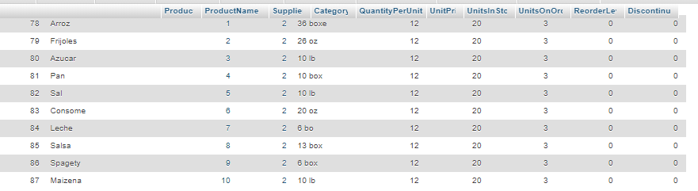

2. Modifique informacion de los productos que acaba de insertar
```sql
UPDATE `products` SET `CategoryID` = '4', `QuantityPerUnit` = '36 lb' WHERE `products`.`ProductID` = 78 
UPDATE `products` SET `CategoryID` = '5', `UnitPrice` = '14' WHERE `products`.`ProductID` = 81 
UPDATE `products` SET `SupplierID` = '6', `QuantityPerUnit` = '30oz' WHERE `products`.`ProductID` = 79 
UPDATE `products` SET `SupplierID` = '6', `CategoryID` = '1' WHERE `products`.`ProductID` = 80 
UPDATE `products` SET `SupplierID` = '13', `QuantityPerUnit` = '15 lb', `UnitPrice` = '15' WHERE `products`.`ProductID` = 82 
UPDATE `products` SET `CategoryID` = '1', `QuantityPerUnit` = '30oz', `UnitsInStock` = '25' WHERE `products`.`ProductID` = 83 
UPDATE `products` SET `QuantityPerUnit` = '8 box', `UnitPrice` = '15', `ReorderLevel` = '1' WHERE `products`.`ProductID` = 84 
UPDATE `products` SET `SupplierID` = '26', `QuantityPerUnit` = '15 box', `UnitPrice` = '10', `UnitsInStock` = '30', `ReorderLevel` = '1' WHERE `products`.`ProductID` = 85 
UPDATE `products` SET `SupplierID` = '26', `CategoryID` = '1' WHERE `products`.`ProductID` = 86 
UPDATE `products` SET `SupplierID` = '12', `QuantityPerUnit` = '15 box' WHERE `products`.`ProductID` = 87

```
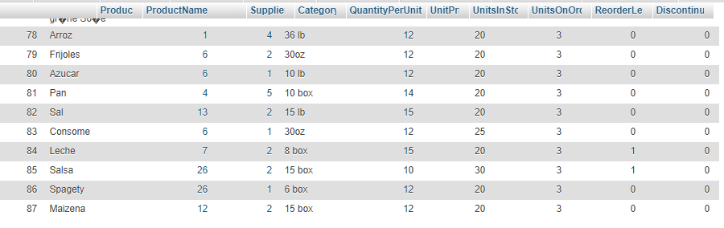

3. Elimine los ultimos 5 productos insertados.
```sql
DELETE FROM Products WHERE ProductID ORDER BY ProductID DESC LIMIT 5
```
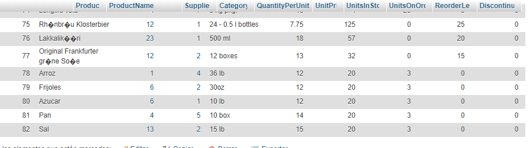

4. Seleccione todas las columnas de la tabla products
```sql
SELECT * FROM 'products'
```
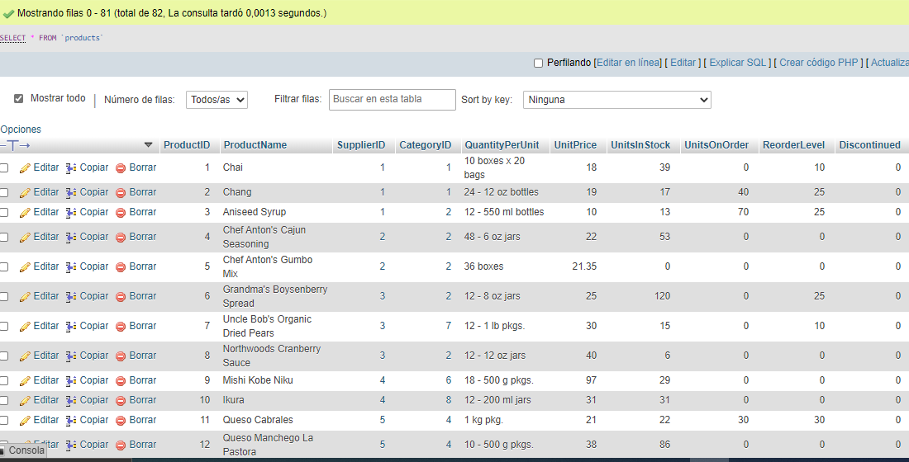

5. Muestre el campo ProductName, QuantityPerUnit, y UnitPrice de la tabla Products.
```sql
SELECT `ProductName`, `QuantityPerUnit`, `UnitPrice` FROM `products` WHERE 1
```
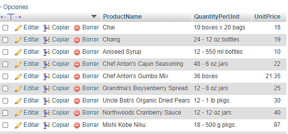

6. Muestre los CategoryID que se encuentran en la tabla products.
```sql
SELECT `CategoryID` FROM `products` WHERE 1
```
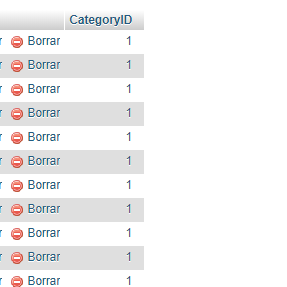

7. Muestre un listado de las ultimas 10 ordenes de la tabla orders.
```sql
SELECT * FROM `orders` ORDER BY `OrderID` DESC LIMIT 10
```
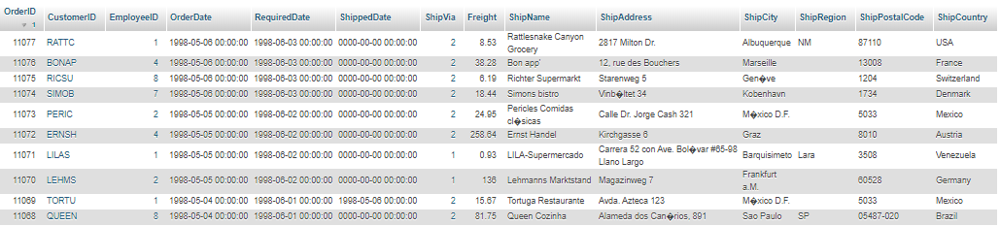

8. Inserte 10 nuevos empleados en la tabla employees.
```sql
INSERT INTO `employees` 
VALUES (NULL,'Torres','Keny','Hola Mundo','ES','2000-03-20 00:00:00','1992-05-01 00:00:00','Canton El Papalon','San Miguel','WE',1234,'ES','(206) 555-9857',12234,NULL,'Education includes a BA in psychology from Colorado State University in 1970.  She also completed "The Art of the Cold Call."  Nancy is a member of Toastmasters International.',3,'http://accweb/emmployees/davolio.bmp'),
(NULL,'Chavez','Lisbeth','Hola Mundo','ES','2000-03-20 00:00:00','1992-05-01 00:00:00','Canton El Papalon','San Miguel','WE',1234,'ES','(206) 555-9857',12234,NULL,'Education includes a BA in psychology from Colorado State University in 1970.  She also completed "The Art of the Cold Call."  Nancy is a member of Toastmasters International.',3,'http://accweb/emmployees/davolio.bmp'), 
(NULL,'Morales','Antonio','Hola Mundo','ES','2000-03-20 00:00:00','1992-05-01 00:00:00','Canton El Papalon','San Miguel','WE',1234,'USA','(206) 555-9857',12234,NULL,'Education includes a BA in psychology from Colorado State University in 1970.  She also completed "The Art of the Cold Call."  Nancy is a member of Toastmasters International.',3,'http://accweb/emmployees/davolio.bmp'), 
(NULL,'Villalobos','Roxana','Hola Mundo','ES','2000-03-20 00:00:00','1992-05-01 00:00:00','Canton El Papalon','San Miguel','WE',1234,'ES','(206) 555-9857',12234,NULL,'Education includes a BA in psychology from Colorado State University in 1970.  She also completed "The Art of the Cold Call."  Nancy is a member of Toastmasters International.',3,'http://accweb/emmployees/davolio.bmp'), 
(NULL,'Guzman','Javier','Hola Mundo','ES','2000-03-20 00:00:00','1992-05-01 00:00:00','Canton El Papalon','San Miguel','WE',1234,'ES','(206) 555-9857',12234,NULL,'Education includes a BA in psychology from Colorado State University in 1970.  She also completed "The Art of the Cold Call."  Nancy is a member of Toastmasters International.',3,'http://accweb/emmployees/davolio.bmp'), 
(NULL,'Martinez','Guadalupe','Hola Mundo','ES','2000-03-20 00:00:00','1992-05-01 00:00:00','Canton El Papalon','San Miguel','WE',1234,'ES','(206) 555-9857',12234,NULL,'Education includes a BA in psychology from Colorado State University in 1970.  She also completed "The Art of the Cold Call."  Nancy is a member of Toastmasters International.',3,'http://accweb/emmployees/davolio.bmp'), 
(NULL,'Moraga','Nleson','Hola Mundo','ES','2000-03-20 00:00:00','1992-05-01 00:00:00','Canton El Papalon','San Miguel','WE',1234,'ES','(206) 555-9857',12234,NULL,'Education includes a BA in psychology from Colorado State University in 1970.  She also completed "The Art of the Cold Call."  Nancy is a member of Toastmasters International.',3,'http://accweb/emmployees/davolio.bmp'), 
(NULL,'Campos','Rafa','Hola Mundo','ES','2000-03-20 00:00:00','1992-05-01 00:00:00','Canton El Papalon','San Miguel','WE',1234,'ES','(206) 555-9857',12234,NULL,'Education includes a BA in psychology from Colorado State University in 1970.  She also completed "The Art of the Cold Call."  Nancy is a member of Toastmasters International.',3,'http://accweb/emmployees/davolio.bmp'), 
(NULL,'Torres','Kevin','Hola Mundo','ES','2000-03-20 00:00:00','1992-05-01 00:00:00','Canton El Papalon','San Miguel','WE',1234,'ES','(206) 555-9857',12234,NULL,'Education includes a BA in psychology from Colorado State University in 1970.  She also completed "The Art of the Cold Call."  Nancy is a member of Toastmasters International.',3,'http://accweb/emmployees/davolio.bmp'), 
(NULL,'Perez','Jeff','Hola Mundo','ES','2000-03-20 00:00:00','1992-05-01 00:00:00','Canton El Papalon','San Miguel','WE',1234,'ES','(206) 555-9857',12234,NULL,'Education includes a BA in psychology from Colorado State University in 1970.  She also completed "The Art of the Cold Call."  Nancy is a member of Toastmasters International.',3,'http://accweb/emmployees/davolio.bmp')
```
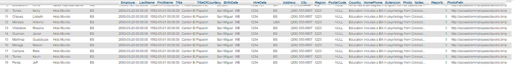

9. Muestre todos los registros de la tabla employees ordenados por el FirtsName de A - Z.
```sql
SELECT * FROM `employees` ORDER BY `FirstName` ASC 
```
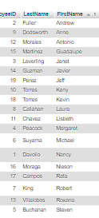

10. Muestre los registros de la tabla employees donde su fecha de cumpleaños (BirthDay) este entre 1960 y 1993.
```sql
SELECT * FROM `employees` WHERE `BirthDate` BETWEEN '1960-01-01' AND '1993-12-31'
```
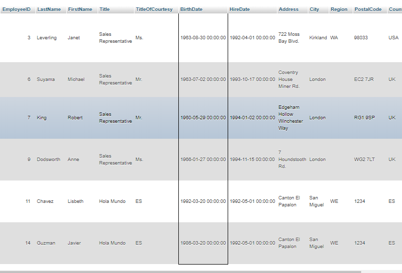


11. Muestre un listado de ordenes (order) el cual debe contener lo siguiente el código
de orden (orderID), el nombre del cliente (contactName) y la fecha de orden
(OrderDate)

```sql
select 
       O.OrderID as codigo, 
       C.CompanyName as cliente, 
       O.OrderDate as fechaCompra 
from Orders as O 
    inner join Customers C on O.CustomerID = C.CustomerID;
```


12. Muestre un listado de ordenes (order) el cual debe contener lo siguiente el código
de orden (orderID), el nombre del cliente (contactName) y la fecha de orden
(OrderDate) fitrado por el id del cliente.

```sql
select
       O.OrderID as codigo,
       C.CompanyName as cliente,
       O.OrderDate as fechaCompra
from Orders as O
    inner join Customers C on O.CustomerID = C.CustomerID
where C.CustomerID = 'VINET';
```

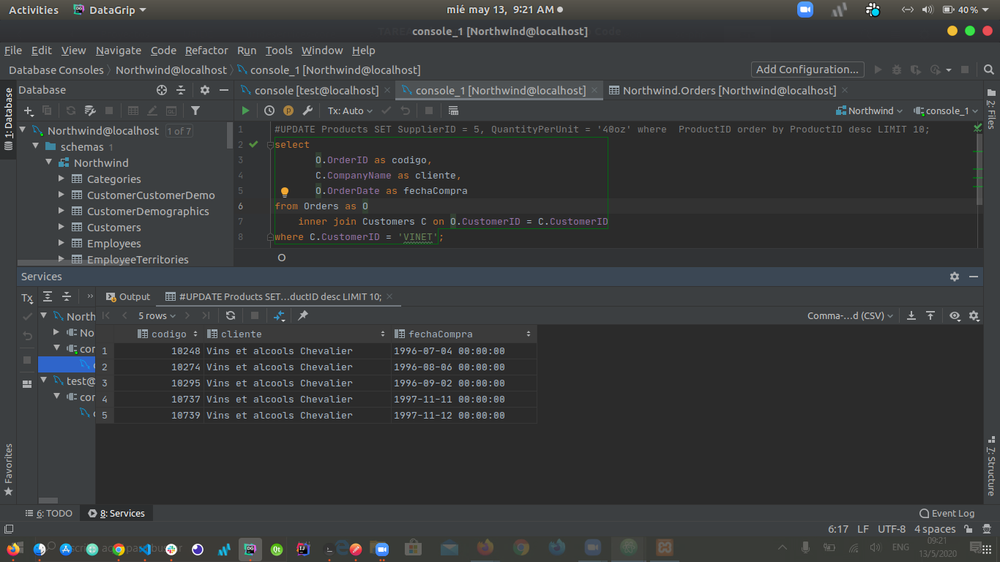

13. Cree una consulta que muestre el numero de ordenes por cliente

```sql
select 
       C.CompanyName as cliente, 
       COUNT(O.CustomerID) as ordenes 
from Orders as O 
    inner join Customers C on O.CustomerID = C.CustomerID 
group by O.CustomerID;
```


14. Cree una consulta que muestre el listdo de productos cuyo nombre empiece con M

```sql
select *
from Products
where ProductName like 'M%'
```


15. Cree una consulta que muestre el listado de productos cuyo nombre termine en una
vocal

```sql
select * from Products 
where ProductName LIKE '%a' or 
      ProductName LIKE '%e' or 
      ProductName LIKE '%i' or 
      ProductName LIKE '%o' or 
      ProductName LIKE '%u';
```

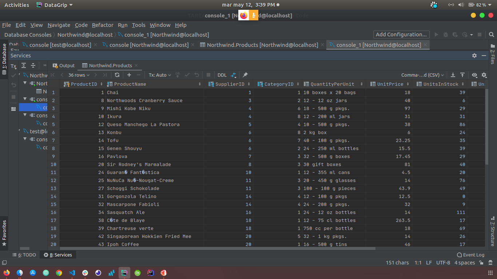

16. Cree una consulta que muestre un listado de productos cuyo nombre tenga una u

```sql
select * from Products where ProductName LIKE '%u%';
```

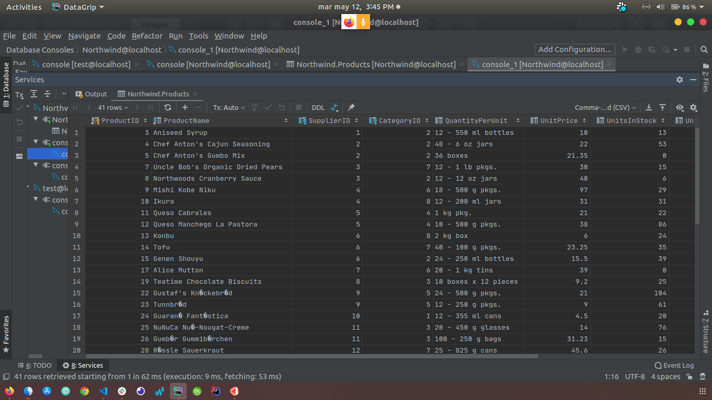

17. Cree una consulta que muestre un listado de productos cuyo UnitsInStock sea igual
a 0

```sql
select * 
from Products 
where UnitsInStock = 0
```

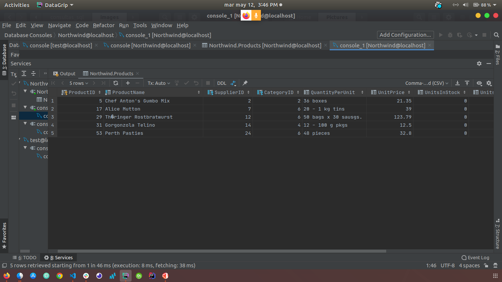

18. Cree una consulta que muestre el detalle de una orden en específico, deberá
contener los siguientes campos: el código de la orden (OrderID), nombre del
empleado (firstName), nombre del producto (productName), precio unitario del
producto (UnitPrice), cantidad (Quantity) y el descuento (Discount). Cada campo
deberá tener el alias que se indica en el enunciado, el filtro se deberá aplicar según
él código de la orden 

```sql
select
       O.OrderID as codigoOrden,
       E.FirstName as empleado,
       P.ProductName as producto,
       OD.UnitPrice as precioUnitario,
       OD.Quantity as cantidad,
       OD.Discount as descuento
from Orders O
    inner join Employees E on O.EmployeeID = E.EmployeeID
    inner join OrderDetails OD on O.OrderID = OD.OrderID
    inner join Products P on OD.ProductID = P.ProductID
where O.OrderID = 10258;
```


19. Cree una consulta que permita visualizar el total por orden deberá mostrar los
campos. OrderID, total de la orden

```sql
select O.OrderID as codigo, 
    SUM((OD.Quantity * OD.UnitPrice) * (1 - OD.Discount)) as total 
from Orders as O 
join OrderDetails OD on O.OrderID = OD.OrderID 
group by O.OrderID;
```

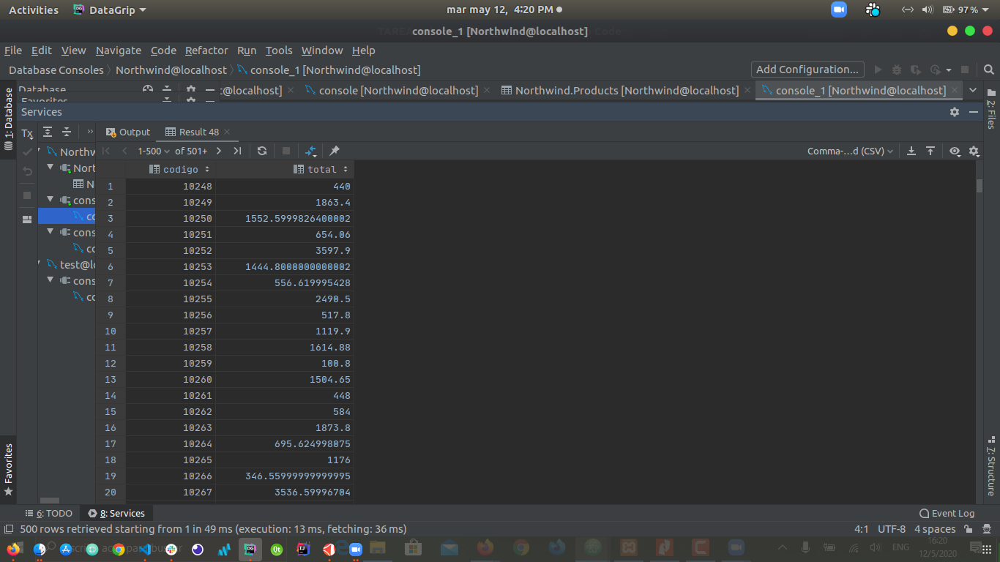

20. Cree una consulta que permita visualizar un reporte de órdenes, queda bajo su
criterio mostrar los campos más representativos para su reporte

```sql
select O.OrderID as codigo,
       C.CompanyName as cliente,
       CONCAT(E.FirstName, ' ', E.LastName) as vendedor,
       O.ShipCountry as country,
       O.ShipCity as city,
       O.ShipAddress as direccion,
       O.OrderDate as fechaVenta,
       SUM(OD.Quantity) as cantidadProductos,
       SUM((OD.Quantity * OD.UnitPrice) * (1 - OD.Discount)) as total
from Orders as O
    join OrderDetails OD on O.OrderID = OD.OrderID
    join Customers C on O.CustomerID = C.CustomerID
    join Employees E on O.EmployeeID = E.EmployeeID
group by O.OrderID;
```

